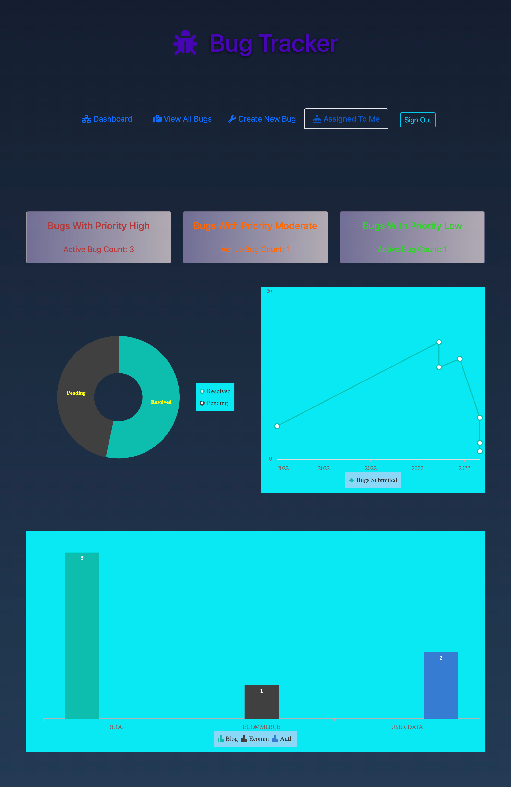
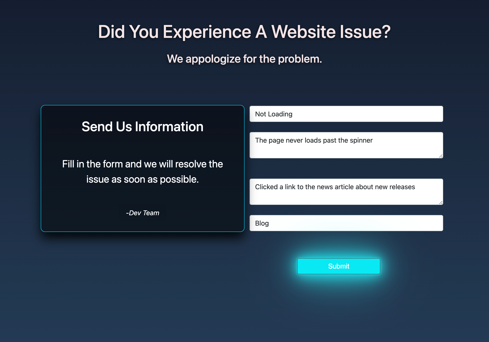

# Bug Tracker Web App

In-house developement agency tool to keep track of website issues from client feedback

## Table of contents

- [General info](#general-info)
- [Live Site](#project-demo)
- [Project Video](#project-video)
- [Technologies](#technologies)
- [Features](#features)
- [Inspiration](#inspiration)
- [Contact](#contact)

## General info

This bug tracker is an easy-to-use web application useful in order to capture and track public feedback concerning problems encountered on websites. It provides a way to manage bugs for any medium or small scale team managing multiple websites. This is a unique site that also integrates data charts to better visualize team and tech stack performances.

<div align="center">Home Page and Dashboard: </div>
<br/>
<div align="center">
<kbd>

</kbd>
</div>
<br />
<div align="center">Public Feedback Form: </div>
<br/>
<div align="center">
<kbd>

</kbd>
</div>

## Project Demo

[Click to view live site](https://62c1be1a7a230426936e3163--bug-tracker-mern-app.netlify.app/user/login)

## Project Video

(https://youtu.be/3Wd7Y7kmVG0)

## Technologies

### Backend Development

- Node.js - version 14.17.5
- Express - version 4.18.1
- JWT - version 8.5.1
- Mongoose - version 6.3.3

### Frontend Development

- JavaScript (ES6)
- HTML5
- CSS3
- React.js - version 18.1.0
- React-DOM - version 18.1.0
- Redux-Toolkit version 1.8.1
- Reactstrap - version 9.0.2
- Syncfusion ej2 React-Charts version - 20.2.36

## Code Examples

### Node.js/Express.js

```Node
export const signUp = async (req, res) => {
  const { firstName, lastName, userName, password } = req.body;

  try {
    const isUser = await User.findOne({ userName });

    if (isUser) {
      return res.status(400).json({ message: "User name already exists" });
    }

    const salt = await bcrypt.genSalt(10);
    const hashedPassword = await bcrypt.hash(password, salt);

    const result = await User.create({
      firstName,
      lastName,
      userName,
      password: hashedPassword,
    });

    res.status(201).json({
      _id: result._id,
      userName: result.userName,
      firstName: result.firstName,
      lastName: result.lastName,
      role: result.role,
      token: generateToken(result._id),
    });
  } catch (error) {
    res.status(400).json({ message: error.message });
    console.log(error);
  }
};
```

### JavaScript/React.js

```
export default function Dashboard() {
const dispatch = useDispatch();
const bugs = useSelector(selectAllBugs);
const bugStatus = useSelector(getBugsStatus);
const error = useSelector(getBugsError);

let content;
let highCount = 0;
let midCount = 0;
let lowCount = 0;

if (bugStatus === "loading") {
content = <p className="m-5 text-center"> Loading........</p>;
} else if (bugStatus === "succeeded") {
highCount = filterBugs(1);
midCount = filterBugs(2);
lowCount = filterBugs(3);
content = (
<div style={{ height: "inherit" }}>
<Row>
<Col className="mt-5" md="4">
<DashboardItem priority="1" count={highCount.length} />
</Col>
<Col className="mt-5" md="4">
<DashboardItem priority="2" count={midCount.length} />
</Col>
<Col className="mt-5" md="4">
<DashboardItem priority="3" count={lowCount.length} />
</Col>
</Row>
<Row>
<Col className="mt-5" md="6">
<Pie legendVisiblity height="full" />
</Col>
<Col className="mt-5" md="6">
<LineChart />
</Col>
</Row>
<Row>
<Col className="mt-5" md="12">
<Bar />
</Col>
</Row>
</div>
);
} else if (bugStatus === "failed") {
content = <p>{error}</p>;
}

function filterBugs(priority) {
return bugs.filter((bug) => {
return bug.priority === priority && bug.complete === false;
});
}

useEffect(() => {
if (bugStatus === "idle") {
dispatch(fetchBugs());
}
}, [bugStatus, dispatch]);

return (
<div className="container-sm">
<Navigation />
{content}
</div>
);
}

```

## Features

- Full stack web application utilizing MongoDB, Express.js, React, and Node.js with state mangagement using redux-toolkit.
- A Public Form to link into any website to provide clients with an option to report a problem they encountered.
- Authorization and authenication implemented with JWT and bcrypt. Custom hook to protect front end routes and re-direct to login.
- Front-End css styles with button hover light-up animation, chart components built with Syncfusion components.
- View and analyze Bug data through charts that include: Unresolved Bug Priority Count, Pending/Completed Bugs, Frequency of Bugs Posted over the current year, the Bug count per website.
- Users can create an account through the application. Users can submit new Bugs, and mark complete those that have been assigned to them by the admin account.
- The admin account can edit and delete Bugs and assign them to the users where they will then find them in the mybugs page.

## Status

The project is deployed and in use by the creator. Public may use repo as needed.

## Inspiration

Through building other projects the problems from user feedback was by word of mouth and difficult to get or keep track of. This will provide a solution for myself or a small team managing multiple websites. This project was also intended as an oportunity to improve my delevelopment skills.

## Contact

Created by [Jesse Hall](https://www.linkedin.com/in/jessehall/)
Feel free to contact me for any questions!

```

```
